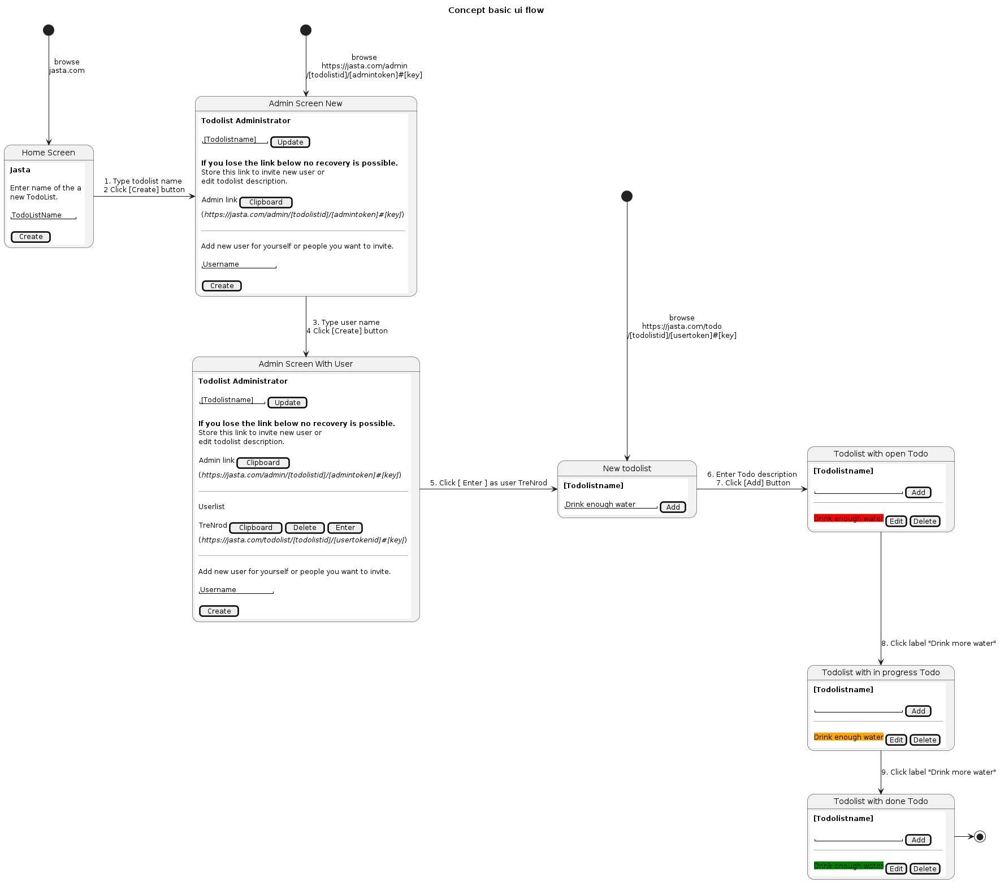

# Status: pre-alpha

# JASTA (Just another simple TODO app)

## Feature overview - First iteration MVP
## Dont use if
- Dont trust people you share the links to your todo
- Want roles like admin and dedicated read/write permissions

### Core features
- Simple. Just 3 stated Open, In progress, Done
- No cookies
- No external dependencies
- No ads (Please offer me a coffee to keep it running and motivate me to improve it TODO: link)
- Open Source (TODO: link client/server github)
- Encrypted keys only stored in clients
- Anonymous with only one exception 24h IP logs for Firewall rules only
- Automatic deletion of lists after 14days not used
- Instant manual deletion

TODO: add gifs
TODO: link demo

# Concept

## Security
- all freetext, like todo and username, is encrypted
- encryption key is generated by the client
- encryption key is only stored in the admin and user link as url fragment never on server. As all freetext data is send and received encrypted (not sended to the backend)
- encryption key validation is done by storing a SHA256 hash of the key on the server
- encryption key hash is only provided by query string (encrypted by HTTPS)



<details>
<summary><b>PlantUML code concept Wireframes</summary>


</details>

# Components


<details>
<summary><b>PlantUML code</summary>

```plantuml

@startuml OverviewJASTAComponents

title Overview JASTA components

!include https://raw.githubusercontent.com/plantuml-stdlib/C4-PlantUML/master/C4_Container.puml

!include <office/Services/web_services>
!include <office/Servers/web_server>
!include <office/Servers/server_generic>
!include <office/sites/website>
!include <office/databases/database>

Person(user, "User", "Person who wants to use JASTA to create and track todos.")
Person(admin, "Admin", "Create and maintain JASTA instances")

Container(deployment, "Deployment Server", "Ansible, Terraform", "Create VM instances and provisioning JASTA",  $sprite="server_generic")

System_Boundary(jasta, JASTA, "Docker-Compose") {
    Container(webclient, "Web Client (SPA)", "React, Typescript", "Provides web apps to the browser. TLS termination. API Gateway and firewall.",  $sprite="website")

    Container(caddy, "Web Server", "Caddy2, Go", "Provides web apps to the browser. TLS termination. API Gateway and firewall.",  $sprite="web_server")

    Container(api, "API", "FastAPI, Python", "Provides interface for web client CRUD todolists and todos.",  $sprite="web_services")

    Container(database, "SQLite Database", "SQLite", "Provides interface for web client CRUD todolists and todos.",  $sprite="database")
}

Rel(user, caddy, "browse to jasta.newawesome.org", "https")
Rel(user, webclient, "Create and manipulate todolists and todos", "https")
Rel_L(caddy, webclient, "delivers to users browser")
Rel(webclient, api, "API calls for CRUD operations on todolists and todos", "https, json")
Rel_R(api, database, "Read/Write", "tcp")
Rel(admin, deployment, "Read/Write", "tcp")
Rel(deployment, jasta, "Read/Write", "tcp")

@enduml

```

</details>


